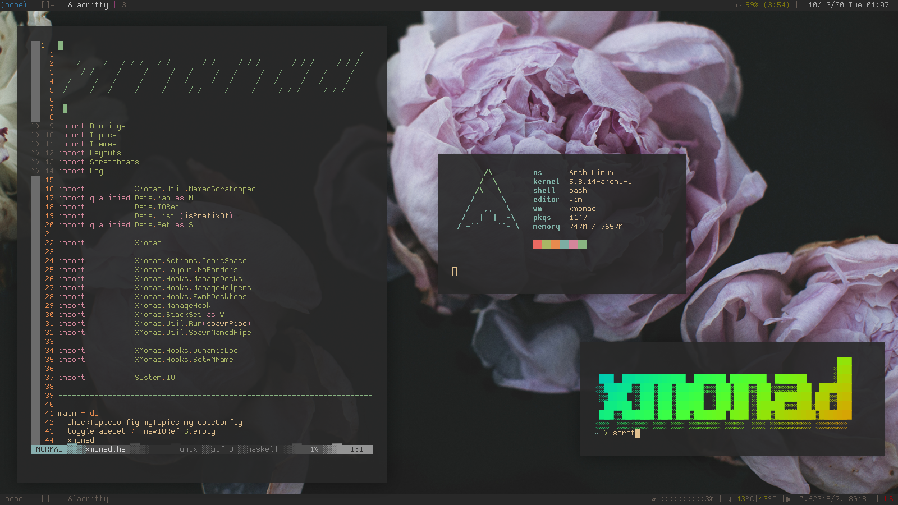
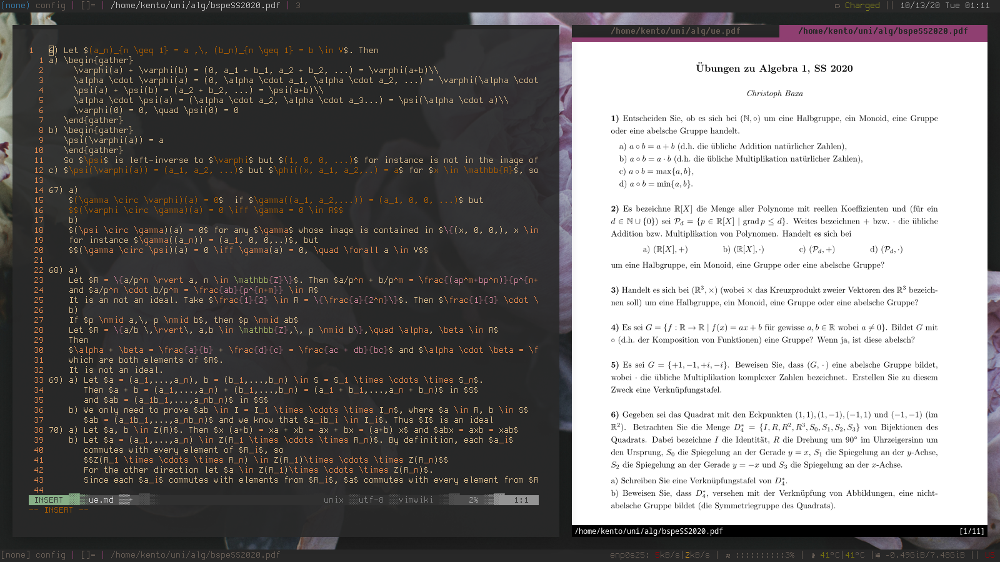

# My Build of XMonad

## Layouts
Layouts available are:
- ResizableTall in with a tabbed sublayout
- mirrored ResizableTall
- fullscreen

## Hooks
### Startup Hook
Launch 4 bars for 3 monitors. The botom bar log hook duplicates the top one
at the moment. Eventually I'll write a custom log hook

### NamedScratchPads
One of my favorite features. Contains scratchpads for:
- terminal
- htop
- discord
- mail
- vimwiki
- pfetch
- cava

## TopicSpaces 
This module allows you to associeate a workspace with a directory and some
default actions.
For instance:  Going to the "site" workspace launches two terminals in the
configured directories and opens the webpage that is hosted locally with hakyll
in my browser. 
The "cv" workspace is configured to open my CV in zathura and the source file
in vim. 
This allows me to keep my workspaces neatly organized and makes working on complex 
projects simpler.

## TreeSelect
A bookmarking system for common commands/tasks that is organized in a tree-like structure.

## Keybinds
I set my escape-key to super, so I think this config works best with that.
These change regularly, I might not update this table below as often.

### basics
| modifiers    | key    | action                               |
| :----------: | :----: | :----------------------------------: |
| Mod4         | Return | terminal in current topic directory  |
| Mod4 + Shift | Return | terminal in home directory           |
| Mod4         | j      | focus down                           |
| Mod4         | k      | focus up                             |
| Mod4 + Shift | j      | move down                            |
| Mod4 + Shift | k      | move up                              |
| Mod4         | d      | rofi                                 |
| Mod4         | w      | qutebrowser                          |
| Mod4         | r      | ranger                               |
| Mod4         | Tab    | nextLayout                           |
| Mod4         | t      | tiling Layout                        |
| Mod4         | b      | hide bar (weird with gaps)           |
| Mod4 + Shift | h      | increase number of masters           |
| Mod4 + Shift | l      | decrease number of masters           |
| Mod4         | h      | shrink master area                   |
| Mod4         | l      | grow master area                     |
| Mod4 + Shift | c      | kill client                          |
| Mod4         | q      | restart xmonad                       |
| Mod4 + Shift | q      | exit xmonad                          |

### workspaces
| modifiers    | key    | action               |
| :----------: | :----: | :------------------: |
| Mod4         | g      | promptedGoto         |
| Mod4 + Shift | g      | promptedShift        |
| Mod4         | a      | default topic action |

### scratchpads
| modifiers    | key    | action                     |
| :----------: | :----: | :------------------------: |
| Mod4         | space  | terminal scratchpad        |
| Mod4 + alt   | w      | hakyll server scratchpad   |
| Mod4 + alt   | t      | htop  scratchpad           |
| Mod4 + alt   | f      | pfetch scratchpad          |
| Mod4 + alt   | c      | cava scratchpad            |

### floating windows
| modifiers    | key        | action                     |
| :----------: | :----:     | :------------------------: |
| Mod4         | arrow keys | move window                |
| Mod4 + shift | arrow keys | resize window              |
| Mod4         | w          | hakyll server scratchpad   |
| Mod4         | t          | htop  scratchpad           |
| Mod4         | f          | pfetch scratchpad          |
| Mod4         | c          | cava scratchpad            |
